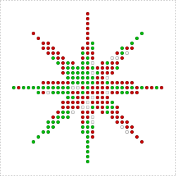
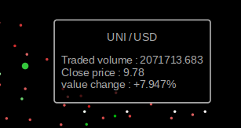
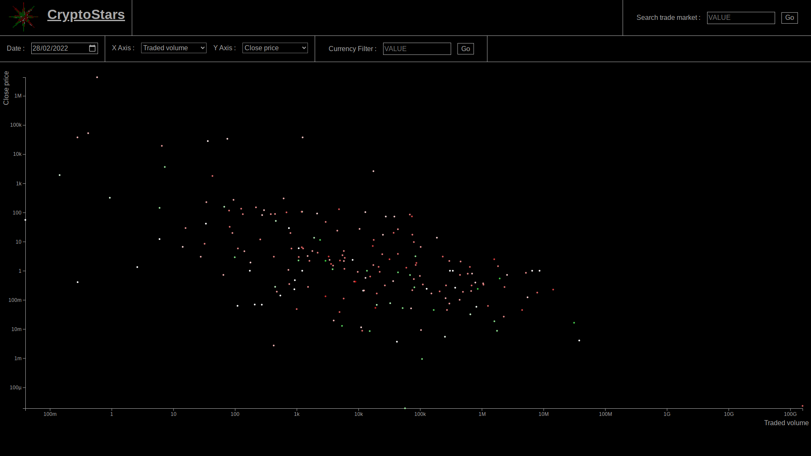
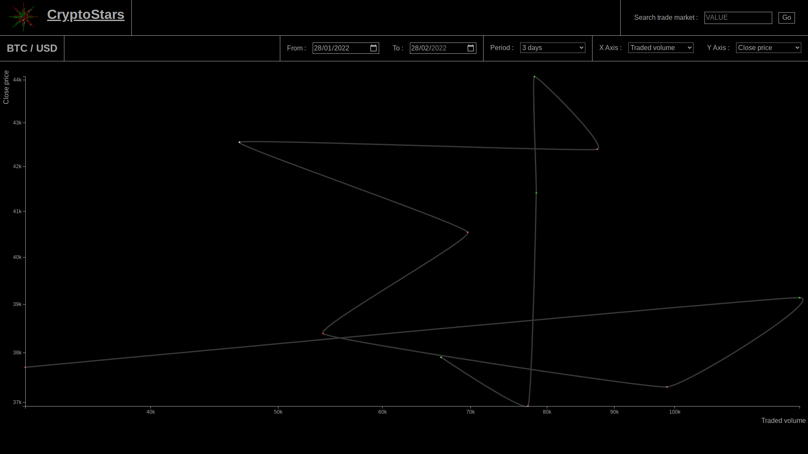
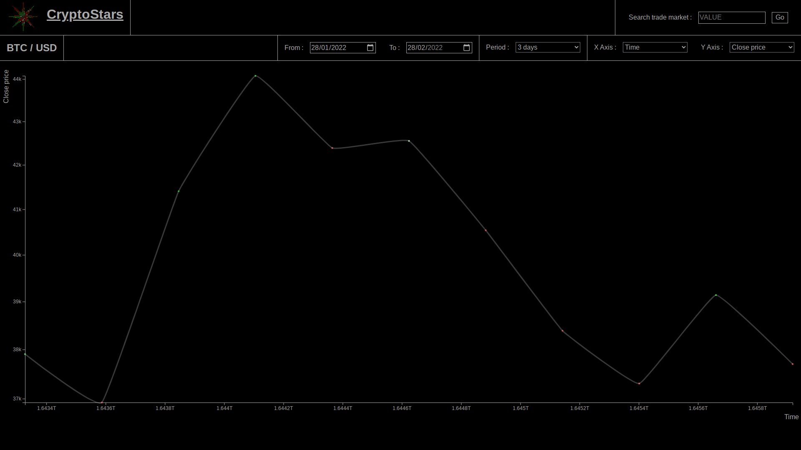

# CryptoStars

CryptoStars is an app allowing users to see crypto market data in different ways.
It uses data from the [poligon.io](https://polygon.io/) API.

CryptoStars is available [here](https://cryptostars.bbaloup.fr) !

## Dependencies

- [Vue.js](https://vuejs.org/)
- [Axios](https://github.com/axios/axios) - Promise based HTTP client
- [D3.js](https://github.com/d3/d3) - Data visualizing library

## Main Features

### Search

You can find in the header a homemade accessible search bar that will allow you to search and go to the history page for a currency pair of your choice.

### Plots

Each plot on this app can be zommed and/or panned.  

Also, when close enough the closest point to your cursor will get bigger and a tooltip will become visible showing the associated values.  

#### Market overview

On the homepage, you can find a scatter plot of the state of the market. Each point represents a currency pair.  
Here you can choose the day from with the data is taken, you can filter by a single currency, and you can select what data is used for each axes.  
The color of each point represents the difference between the opening value and the closing value of the currency pair on the chosen date.  
Clicking on one of these points will get you to the corresponding "Currency pair history" page. 

#### Currency pair history

On this page, you will get a history of the values of the chosen currency pair.
You will be able to choose the period of time of this history and how much time represents one point.

The line between the points shows the flow of time between them.

## TODO

Making it mobile friendly
